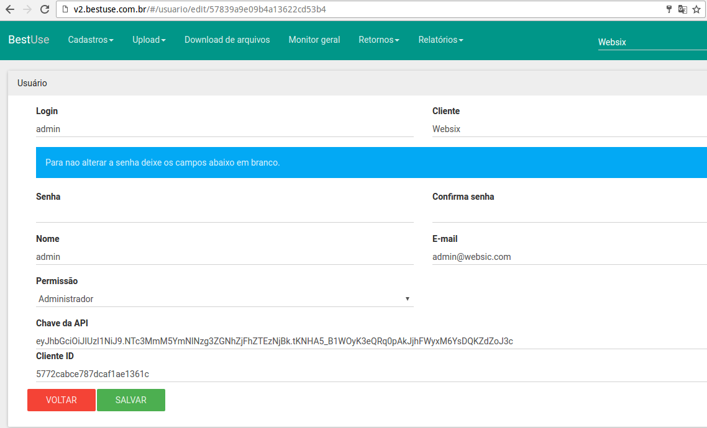
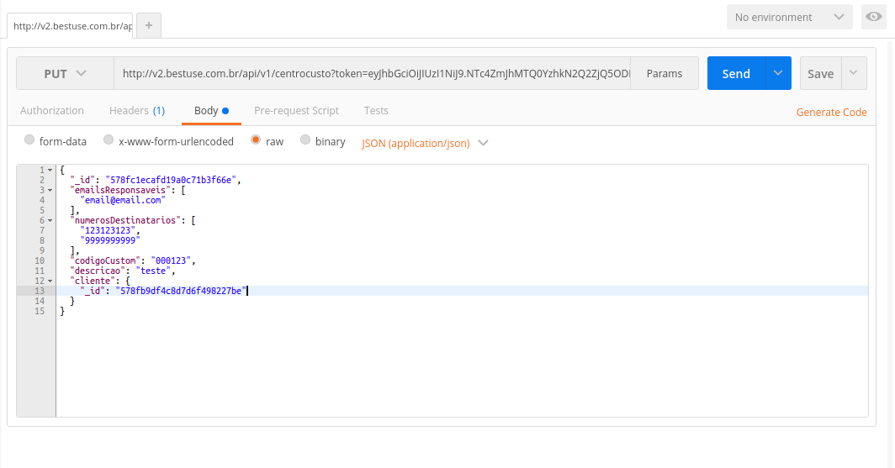
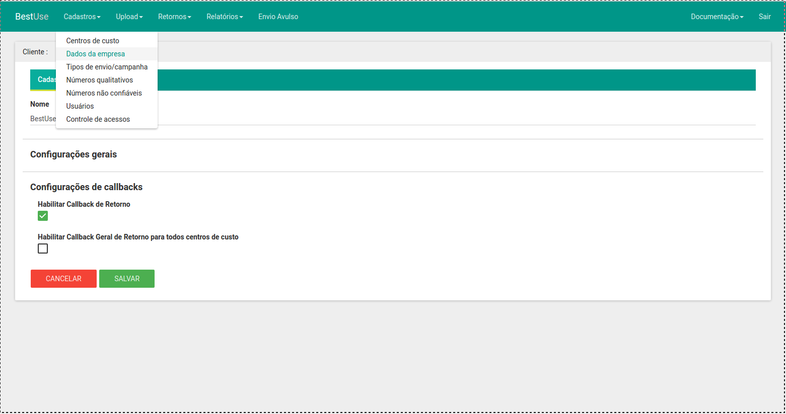

# Api Bestuse v2

[Centros de custo](#centros-de-custo)

[Envio de SMSs](#envio-de-smss-via-api)

[Relatorio por arquivo](#relatorio-de-sms-de-arquivo)

[Retornos](#retornos-caixa-de-entrada)

[Callback de Retornos](#callback-de-retornos)

##### HTTP REST API
#### Se o Content-Type não for especificado provalmente sua aplicação não vai funcionar.
##### Content-Type: application/json

> Para gerar seu **token** acesse a plataforma [V2](http://v2.bestuse.com.br) Navegue até **cadastros -> usuários** clique em editar o usuário que deseja fornecer acesso via api, nessa tela vamos ter um campo chamado **Chave da API** e nessa mesma tela o **Cliente ID**



> Para fins de testes recomendamos usar o [POSTMAN](https://chrome.google.com/webstore/detail/postman/fhbjgbiflinjbdggehcddcbncdddomop?hl=en). Um aplicativo que roda com o chrome para testar requisições para API, o content type deve sempre ser especificado conforme exemplo:



### Centros de Custo

* **Listar**

```
GET http://v2.bestuse.com.br/api/v1/centrocusto?token=CHAVE_DA_API
```

> Paramêtros

Não é necessário passar nenhum paramêtro


> Resposta

```javascript
{
  "total": 8,
  "data": [
    {
      "_id": "5772cd66e787dcaf1ae1361d",
      "cliente": {
        "_id": "5772cabce787dcaf1ae1361c",
        "cliente": true,
        "fornecedor": false,
        "nome": "Websix",
        "isentoIcms": false,
        "optanteSimples": false,
        "referencias": [],
        "enderecos": [],
        "dataCadastro": "2016-06-28T19:06:36.537Z",
        "contatos": [],
        "__v": 0,
        "ativo": true
      },
      "codigoCustom": "cc-testes",
      "descricao": "Centro de custo de testes",
      "__v": 0,
      "numerosDestinatarios": [
        9999999999
      ],
      "emailsResponsaveis": [
        {
          "email": "email@email.com",
          "receberRetornos": "true",
          "recebeInvalidos": "true",
        }
      ]
    },
]
```

---

* **Criar**

```
POST http://v2.bestuse.com.br/api/v1/centrocusto?token=CHAVE_DA_API
```

> Paramêtros

```javascript
{
  "emailsResponsaveis": [
    {
        "email":"email@email.com",
        "recebeInvalidos": true,
        "recebeRetornos": true
    }
  ],
  "numerosDestinatarios": [
    "99999999599"
  ],
  "codigoCustom": "00014523",
  "descricao": "teste",
  "cliente": {
    "_id": "577a75e5dd2a119027031a9f"
  }
}
```

> Resposta

```javascript
{
  "success": true,//Status da requisição
  "data": {
    "__v": 0,
    "codigoCustom": "00014523",
    "descricao": "teste",
    "cliente": "577a75e5dd2a119027031a9f",
    "_id": "579127a02d86e30e3580b81c",//ID do centro de custo gerado
    "numerosDestinatarios": [
      99999999599
    ],
    "emailsResponsaveis": [
      {
        "email": "email@email.com",
        "recebeInvalidos": "true",
        "recebeRetornos": "true",
        "_id": "579127a02d86e30e3580b81d"
      }
    ]
  },
  "err": null,  //Se o status for false o erro será exibido aqui
  "form": { //Para debugar o que está sendo mandado para API
    "emailsResponsaveis": [
      {
        "email": "email@email.com",
        "recebeInvalidos": true,
        "recebeRetornos": true
      }
    ],
    "numerosDestinatarios": [
      "99999999599"
    ],
    "codigoCustom": "00014523",
    "descricao": "teste",
    "cliente": {
      "_id": "577a75e5dd2a119027031a9f"
    }
  }
}

```

---

* **Alterar**

```
PUT http://v2.bestuse.com.br/api/v1/centrocusto?token=CHAVE_DA_API
```

> Paramêtros

```javascript
{
  "_id": "577ab8e49e155d5732e9b9db",
  {
        "email":"email@email.com",
        "recebeInvalidos": true,
        "recebeRetornos": true
  }
  "numerosDestinatarios": [
    "9999999999",
    "9999999999"
  ],
  "codigoCustom": "000123",
  "descricao": "teste",
  "cliente": {
  	"_id": "577a75e5dd2a119027031a9f" //o cliente._id é pego na resposta de uma criação ou listagem dos centros de custo
  }
}
```


> Resposta

```javascript
{
  "success": true,//Status da requisição
  "data": {
    "__v": 0,
    "_id": "577ab8e49e155d5732e9b9db",
    "codigoCustom": "00014523",
    "descricao": "teste",
    "cliente": "577a75e5dd2a119027031a9f",
    "numerosDestinatarios": [
      99999999599
    ],
    "emailsResponsaveis": [
      {
        "email": "email@email.com",
        "recebeInvalidos": "true",
        "recebeRetornos": "true",
        "_id": "579127fd2d86e30e3580b8cf"
      }
    ]
  },
  "err": null, //Se o status for false o erro será exibido aqui
  "form": { //Para debugar o que está sendo mandado para API
    "_id": "577ab8e49e155d5732e9b9db",
    "emailsResponsaveis": [
      {
        "email": "email@email.com",
        "recebeInvalidos": true,
        "recebeRetornos": true
      }
    ],
    "numerosDestinatarios": [
      "99999999599"
    ],
    "codigoCustom": "00014523",
    "descricao": "teste",
    "cliente": {
      "_id": "577a75e5dd2a119027031a9f"
    }
  }
}


```

---

### Envio de SMSs via API

Envio-em-lotes. Este método tem um limite de 1(um) request a cada 5(cinco) segundos.

* **Enviar**

```
POST http://v2.bestuse.com.br/api/v1/envioApi?token=CHAVE_DA_API
```

> Paramêtros

**smss** - Array contendo as mensagens a enviar.

    smss.numero - (string) Número de destino da mensagem

    smss.mensagem - (string) Mensagem

    smss.idCustom - (string) Id unico customizado pelo cliente

**envioImediato** - (bool) Iniciar o envio imediatamente, ignora o agendamento.

**centroCusto** - (string) Identificação do centro de custo.

**agendamento** - Array com os agendamentos.

    agendamento.quantidade - (string) Quantidade em porcentagem do envio.

    agendamento.dataHoraInicio - (string) Data e hora para começar o envio, formato yyyy-mm-dd hh:mm:ss

    agendamento.dataHoraFim - (string) Data e hora para começar o envio, formato yyyy-mm-dd hh:mm:ss


**Exemplos**

```javascript
{
  "smss":[
       {
          "numero": "1199999999",
          "idCustom": "1",
          "mensagem": "Sr(a) Fulano. Aproveite esta oportunidade e resolva suas pendencias educacionais."
       },
       {
          "numero": "+551199999999",
          "idCustom": "2",
          "mensagem": "Sr(a) Fulano. Aproveite esta oportunidade e resolva suas pendencias educacionais."
       }
   ],
   "envioImediato": false,
   "centroCusto": "5772cd66e787dcaf1ae1361d",
   "agendamento": [
       {
           "quantidade": "100",
           "dataHoraInicio": "2016-07-04 08:00:00",
           "dataHoraFim": "2016-07-04 10:00:00"
       }
   ]
}
```

**ou para envio imediato**


```javascript
{
  "smss":[
       {
          "numero": "4299999999",
          "idCustom": "1",
          "mensagem": "Sr(a) Fulano. Aproveite esta oportunidade e resolva suas pendencias educacionais. Ligue 70 7070-7070"
       },
       {
          "numero": "1199999999",
          "idCustom": "2",
          "mensagem": "Sr(a) Marcio. Aproveite esta oportunidade e resolva suas pendencias educacionais. Ligue 70 7070-7070"
       }
   ],
   "envioImediato": true,
   "centroCusto": "5772cd66e787dcaf1ae1361d"
}
```

> Resposta

```javascript
{
 "success": true,
 "data": {
   "totalSmsSalvos": 2,
   "arquivoGerado": "envioAPI/envio_api_LOTES_2016-09-20 10:03:26:200_Websix.api",
   "id": "57e1339ee9158a6211534279" <- id do arquivo gerado
 },
 "err": "",
 "msg": "Lote submetido com sucesso!"
}


  {
    "success": true,
    "err": "",
    "id": "58a47922b3f7873826da2791", // id do arquivo (lote) gerado // esse campo não vem quando vai salvar na temp
    "msg": "Lote recebido com sucesso",
    "bloqueados": 1, // total de sms bloqueados pelo tamanho da mensagem
    "validos": 2, // total de smss validos
    "invalidos": 0, // total de smss invalidos
    "smsBloqueados": [ // sms que foram bloqueados devido ao tamanho da mensagem (opção ativada no cliente)
      {
        "numero": "4299981464",
        "mensagem": "Sr(a) Fulano. Aproveite esta oportunidade e resolva suas pendencias educacionais.Sr(a) Fulano. Aproveite esta oportunidade e resolva suas pendencias educacionais.Sr(a) Fulano. Aproveite esta oportunidade e resolva suas pendencias educacionais."
      }
    ],
    "smsSalvos": [ //array de sms que foram realmente salvos no lote gerado
      {
        "numero": "42999981464",
        "mensagem": "Sr(a) Fulano. Aproveite esta oportunidade e resolva suas pendencias educacionais."
      },
      {
        "numero": "42999981464",
        "mensagem": "Sr(a) Fulano. Aproveite esta oportunidade e resolva suas pendencias educacionais."
      }
    ]
  }
```

```
//Envio em lote com envio imediato /Envio em lote com criação de lotes
  {
    "success": true,
    "err": "",
    "id": "58a47922b3f7873826da2791", // id do arquivo (lote) gerado // esse campo não vem quando vai salvar na temp
    "msg": "Lote recebido com sucesso",
    "bloqueados": 1, // total de sms bloqueados pelo tamanho da mensagem
    "validos": 2, // total de smss validos
    "invalidos": 0, // total de smss invalidos
    "smsBloqueados": [ // sms que foram bloqueados devido ao tamanho da mensagem (opção ativada no cliente)
      {
        "numero": "4299981464",
        "mensagem": "Sr(a) Fulano. Aproveite esta oportunidade e resolva suas pendencias educacionais.Sr(a) Fulano. Aproveite esta oportunidade e resolva suas pendencias educacionais.Sr(a) Fulano. Aproveite esta oportunidade e resolva suas pendencias educacionais."
      }
    ],
    "smsSalvos": [ //array de sms que foram realmente salvos no lote gerado
      {
        "numero": "42999981464",
        "mensagem": "Sr(a) Fulano. Aproveite esta oportunidade e resolva suas pendencias educacionais."
      },
      {
        "numero": "42999981464",
        "mensagem": "Sr(a) Fulano. Aproveite esta oportunidade e resolva suas pendencias educacionais."
      }
    ]
  }
```

```javascript
//em caso de erros

{
 "success": false,
 "data": {
        "smss": [],
        "envioImediato": "false",
        "centroCusto": "573243641a1sb21c07cd8fbad",
        "agendamento": [],
        "token": "eyJhbGciOiJIUzI1NiJ9.NTc3MmM4YjRhODg4MDAzMTI4ODExM2Qx.IAtPk5LVYarlrWqR0zBMyF9ohGDa3AuTa46AYBREtzA"
 },
 "err": "Erro ao enviar.Centro de custo não encontrado"
}


```

```javascript
  //Erro no envio em lote devido ao limite do centro de custo alcançado
  {
    "success": false,
      "err": "Erro ao enviar.Total mensal do centro de custo undefined disponível: 0"
  }
```

```javascript
  //Erro no envio em lote devido a nao ter nenhum sms na requisição
  {
      "success": false,
      "err": "É necessário pelo 1(um) sms no lote para concluir o envio."
  }

```

```javascript
  /*Erro no envio em lote devido a nao ter a mensagem ou numero em algum dos sms enviados*/
  {
      "success": false,
      "err": "Erro ao enviar lote.Verifique a formatação dos dados"
  }
```

* Para dúvida ou mais informações sobre o uso da API de envio de smss entre em contato com nossa equipe.


---

### Relatorio de sms de arquivo

* **Solicitar relatório**

```
GET http://v2.bestuse.com.br/api/v1/resumoArquivoApi?arquivo=ID_DO_ARQUIVO&token=CHAVE_DA_API

```

> Resposta

```javascript
[
  {
    "_id": "57dd5a920612f8a14c98734f",
    "mensagem": "Mensagem enviada",
    "numero": "9999999999",
    "dataHoraEnvio": "2016-09-17 12:05:35",
    "idCustom": "4",
    "status": "ENVIADO"
  },
  {
    "_id": "57dd5a920612f8a14c987350",
    "mensagem": "Mensagem enviada 2",
    "numero": "8888888888",
    "dataHoraEnvio": "2016-09-17 12:05:35",
    "idCustom": "5",
    "status": "ENVIADO"
  },
  {
    "_id": "57dd5a920612f8a14c98734e",
    "mensagem": "Mensagem enviada 3",
    "numero": "7777777777",
    "dataHoraEnvio": "2016-09-17 12:05:34",
    "idCustom": "6",
    "status": "ENVIADO"
  },
]
```

```javascript
//em caso de erros

{
  "success": false,
  "err": "Erro ao encontrar arquivo"
}
```


### Retornos (Caixa de entrada)

* **Solicitar relatório**

```
POST http://v2.bestuse.com.br/api/v1/retornos?token=CHAVE_DA_API

```

> Paramêtros

```javascript
{
  "dataInicial": "2016-09-12",
  "dataFinal": "2016-09-14",
  "skip": 0,
  "limit": 50,
  "centroCusto": "579680389a7cc35d62f906a2"
}
```

> Resposta

```javascript
{
  "total": 1,
  "data": [
    {
      "_id": "57d944c9624118816766c27c",
      "data": "2016-09-14T12:38:26.000Z",
      "mensagem": "Pode creditar na conta",
      "idCustom": "5",
      "numero": "11999939292",
      "sms": "57d18345f12490f22ce96e2c",
      "cliente": "578fb9df4c8d7d6f498227be",
      "arquivo": "57d18345f12490f22ce96b03",
      "__v": 0,
      "centroCusto": "579680389a7cc35d62f906a2",
      "dataHora": "2016-09-14T12:38:26.000Z",
      "sended": true
    }
  ]
}
```


### Callback de Retornos


> Callback de retorno serve para que toda vez que haver um retorno esse retorno seja mandado para url cadastrada do cliente


* **Callback de retrono por centro de custo**

Para utilizar a Callback de Retorno por centro de custo primeiro tem que marcar a opçao "Habilitar Callback de Retorno" em "Dados da empresa" e salva.



Em seguida vai em editar um dos centro de custo que deseja ter callback de retorno e digite a url de calback de retorno em "Callback de retorno" e salve.


Agora a callback de retorno por centro de custo está configurado, sempre que houver um retorno de menssagem enviado por esse centro de custo a api enviará um **POST** para essa url com o seguinte formato.

```
{ _id: '58a499818d263b30481ce10c',
  mensagem: 'meuretorno10',
  idCustom: '5',
  numero: '42999999999',
  sms: '58a337f2ccab534b778746b4',
  cliente: '5807c572fe10127f255aa1db',
  centroCusto: '5810f286981dd11003f8e4c3',
  arquivo: '58a337ecccab534b778746b1' }
```

* **Callback de retorno geral**

Para utilizar a Callback de Retorno geral primeiro tem que marcar a opçao "Habilitar Callback Geral de Retorno para todos centros de custo" e adicionar a url em "Callback Geral" em "Dados da empresa" e salva.


Agora a callback de retorno geral está configurado, sempre que houver um retorno de menssagem enviado a api enviará um **POST** para essa url com os seguinte formato.

```
{ _id: '58a49a9a8d263b30481ce10d',
  mensagem: 'meuretorno10',
  idCustom: '5',
  numero: '42999735545',
  sms: '58a337f2ccab534b778746b4',
  cliente: '5807c572fe10127f255aa1db',
  centroCusto: '5810f286981dd11003f8e4c3',
  arquivo: '58a337ecccab534b778746b1' }
```