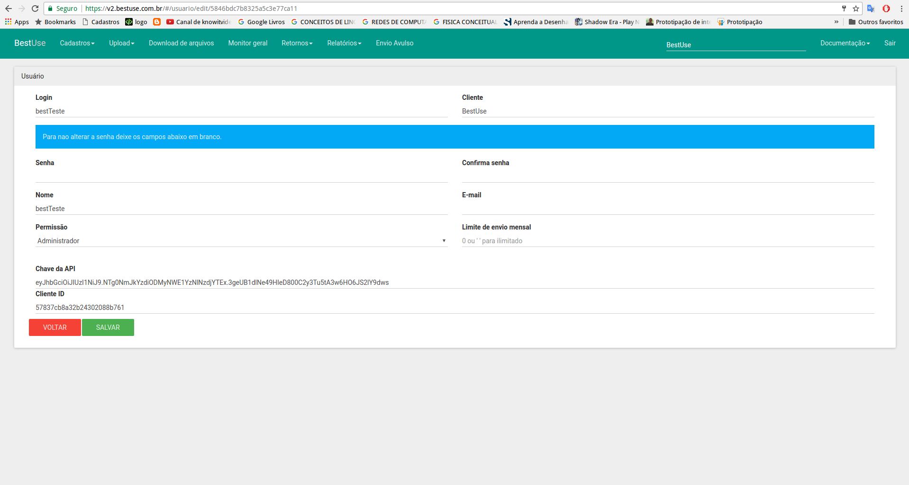

# Api Bestuse v2

[Centros de custo](#centros-de-custo)

[Envio de SMSs](#envio-de-smss-via-api)

[Relatório por arquivo](#relatório-de-sms-de-arquivo)

[Relatório analítico](#relatório-analítico)

[Retornos](#retornos-caixa-de-entrada)

[Callback de Retornos](#callback-de-retornos)

<!-- [Envio Direto](#envio-direto) -->

##### HTTP REST API

#### Se o Content-Type não for especificado provalmente sua aplicação não vai funcionar.

##### Content-Type: application/json

> Para gerar seu **token** acesse a plataforma [V2](https://v2.bestuse.com.br) Navegue até **cadastros -> usuários** clique em editar o usuário que deseja fornecer acesso via api, nessa tela vamos ter um campo chamado **Chave da API** e nessa mesma tela o **Cliente ID**



> Para fins de testes recomendamos usar o [POSTMAN](https://chrome.google.com/webstore/detail/postman/fhbjgbiflinjbdggehcddcbncdddomop?hl=en). Um aplicativo que roda com o chrome para testar requisições para API, o content type deve sempre ser especificado conforme exemplo:


### Centros de Custo

- **Listar**

```javascript
GET http://v2.bestuse.com.br/api/v1/centrocusto?token=CHAVE_DA_API
```

> Paramêtros

Este método funciona como uma paginação onde o padrão do sistema é retornar 25 itens.
Porém é possivael passar dois parâmetros, skip e limit , estes parâmetros determinarão quantos itens serão retornados e a partir de qual item a busca devera começar.
EX:

```javascript
  GET http://v2.bestuse.com.br/api/v1/centrocusto?skip=25&&limit=50&&token=CHAVE_DA_API
```

No caso acima a API irá retonar 50 centros de custo a partir do centro de custo de numero 25.

> Resposta

```javascript
{
  "total": 25, // total de centros de custo cadastrados
  "data": [
    {
      "codigoCustom": "CC_01",
      "descricao": "Centro de custo 01",
      "emailsResponsaveis": [
        {
          "numero": 00000,
          "_id": "58207e3c894afe1e5876c29a",
          "email": "contato@contato.com.br",
          "recebeConfirmacaoEnvio": true
        }
      ],
      "msgs": [],
      "limiteEnvioMensal": 0,
      "totalEnviosMes": 1000,
      "_id": "58207e3c894afe1e5876c298",
      "cliente": {
        "nome": "TESTE API",
        "_id": "581b8a3399df4e4e34f518b3"
      }
    }
  ]
}
```

---

- **Criar**

```javascript
POST http://v2.bestuse.com.br/api/v1/centrocusto?token=CHAVE_DA_API
```

> Paramêtros

```javascript
{
  "emailsResponsaveis": [
    {
      "recebeConfirmacaoEnvio": true,
      "nome": "testes",
      "email": "contato@teste.com.br",
      "numero": "0000000000",
      "recebeInvalidos": true,
      "recebeRetornos": true
    }
  ],
  "msgs": [],
  "descricao": "TESTES CC5",
  "codigoCustom": "TESTES CC5",
  "limiteEnvioMensal": 15000
}
```

> Resposta

```javascript
{
  "success": true,
  "data": {
    "__v": 0,
    "cliente": "5772cabce787dcaf1ae1361c",
    "descricao": "TESTES CC5",
    "codigoCustom": "TESTES CC5",
    "limiteEnvioMensal": 15000,
    "_id": "58af2b4c429dda32685371e0",
    "msgs": [],
    "numerosDestinatarios": [],
    "emailsResponsaveis": [
      {
        "nome": "testes",
        "email": "contato@teste.com.br",
        "numero": 0,
        "recebeInvalidos": "true",
        "recebeRetornos": "true",
        "_id": "58af2b4c429dda32685371e1",
        "recebeConfirmacaoEnvio": true
      }
    ]
  },
  "err": null,
  "form": {
    "emailsResponsaveis": [
      {
        "recebeConfirmacaoEnvio": true,
        "nome": "testes",
        "email": "contato@teste.com.br",
        "numero": "0000000000",
        "recebeInvalidos": true,
        "recebeRetornos": true
      }
    ],
    "msgs": [],
    "descricao": "TESTES CC5",
    "codigoCustom": "TESTES CC5",
  }
}
```

---

- **Alterar**

```javascript
PUT http://v2.bestuse.com.br/api/v1/centrocusto?token=CHAVE_DA_API
```

> Paramêtros

```javascript
{
  "cliente": {
    "_id": "577a75e5dd2a119027031a9f" //o cliente._id é pego na resposta de uma criação ou listagem dos centros de custo
  },
  "_id" : "58af2b16429dda32685371d1",
  "descricao": "TESTES de alteração",
  "codigoCustom": "testes CC",
  "msgs": [],
  "emailsResponsaveis":
  [ {
      "nome": "testes",
      "email": "contato@teste.com.br",
      "numero": 0,
      "recebeInvalidos":  true,
      "recebeRetornos":  true,
      "_id": "58af2b16429dda32685371d2",
      "recebeConfirmacaoEnvio": true
    } ,
    {
      "nome": "testes",
      "email": "contato@teste.com.br",
      "numero": 0,
      "recebeInvalidos":  true,
      "recebeRetornos":  true,
      "_id": "58af2b16429dda32685371d2",
      "recebeConfirmacaoEnvio": true
    }
  ]
}
```

> Resposta

```javascript
{
  "success": true, //status da requisição
  "data": {
    "ok": 1,
    "nModified": 1,
    "n": 1
  },
  "err": null,
  "form": {
    "cliente": {
      "_id": "5772cabce787dcaf1ae1361c"
    },
    "_id": "58af2b16429dda32685371d1",
    "descricao": "TESTES CC tbacaninha",
    "codigoCustom": "testes",
    "msgs": [],
    "emailsResponsaveis": [
      {
        "nome": "testes",
        "email": "contato@teste.com.br",
        "numero": 0,
        "recebeInvalidos": true,
        "recebeRetornos": true,
        "_id": "58af2b16429dda32685371d2",
        "recebeConfirmacaoEnvio": true
      },
      {
        "nome": "testes",
        "email": "contato@teste.com.br",
        "numero": 0,
        "recebeInvalidos": true,
        "recebeRetornos": true,
        "_id": "58af2b16429dda32685371d2",
        "recebeConfirmacaoEnvio": true
      }
    ]
  }
}
```

---

### Envio de SMSs via API

Envio-em-lotes. Este método tem um limite de 1(um) request a cada 5(cinco) segundos.

- **Enviar**

```javascript
POST http://v2.bestuse.com.br/api/v1/envioApi?token=CHAVE_DA_API
```

> Paramêtros

**smss** - Array contendo as mensagens a enviar.

    smss.numero - (string) Número de destino da mensagem

    smss.mensagem - (string) Mensagem

    smss.idCustom - (string) Id unico customizado pelo cliente

**envioImediato** - (bool) Iniciar o envio imediatamente, ignora o agendamento.

**centroCusto** - (string) Identificação do centro de custo.

**agendamento** - Array com os agendamentos.

    agendamento.quantidade - (string) Quantidade em porcentagem do envio.

    agendamento.dataHoraInicio - (string) Data e hora para começar o envio, formato yyyy-mm-dd hh:mm:ss

    agendamento.dataHoraFim - (string) Data e hora para começar o envio, formato yyyy-mm-dd hh:mm:ss

**Exemplos**

```javascript
{
  "smss":[
       {
          "numero": "1199999999",
          "idCustom": "1",
          "mensagem": "Sr(a) Fulano. Aproveite esta oportunidade e resolva suas pendencias educacionais."
       },
       {
          "numero": "+551199999999",
          "idCustom": "2",
          "mensagem": "Sr(a) Fulano. Aproveite esta oportunidade e resolva suas pendencias educacionais."
       }
   ],
   "envioImediato": false,
   "centroCusto": "5772cd66e787dcaf1ae1361d",
   "agendamento": [
       {
           "quantidade": "100",
           "dataHoraInicio": "2016-07-04 08:00:00",
           "dataHoraFim": "2016-07-04 10:00:00"
       }
   ]
}
```

**ou para envio imediato**

```javascript
{
  "smss":[
       {
          "numero": "4299999999",
          "idCustom": "1",
          "mensagem": "Sr(a) Fulano. Aproveite esta oportunidade e resolva suas pendencias educacionais. Ligue 70 7070-7070"
       },
       {
          "numero": "1199999999",
          "idCustom": "2",
          "mensagem": "Sr(a) Marcio. Aproveite esta oportunidade e resolva suas pendencias educacionais. Ligue 70 7070-7070"
       }
   ],
   "envioImediato": true,
   "centroCusto": "5772cd66e787dcaf1ae1361d"
}
```

> Resposta

```javascript
{
  "success": true,
  "errCode": 200,
  "err": "",
  "id": "58a47922b3f7873826da2791", // id do arquivo (lote) gerado // esse campo não vem quando vai salvar na temp
  "msg": "Lote recebido com sucesso",
  "bloqueados": 1, // total de sms bloqueados pelo tamanho da mensagem
  "validos": 2, // total de smss validos
  "invalidos": 0, // total de smss invalidos
  "smsBloqueados": [ // sms que foram bloqueados devido ao tamanho da mensagem (opção ativada no cliente)
    {
      "numero": "4299981464",
      "mensagem": "Sr(a) Fulano. Aproveite esta oportunidade e resolva suas pendencias educacionais.Sr(a) Fulano. Aproveite esta oportunidade e resolva suas pendencias educacionais.Sr(a) Fulano. Aproveite esta oportunidade e resolva suas pendencias educacionais."
    }
  ],
  "smsSalvos": [ //array de sms que foram realmente salvos no lote gerado
    {
      "numero": "42999981464",
      "mensagem": "Sr(a) Fulano. Aproveite esta oportunidade e resolva suas pendencias educacionais."
    },
    {
      "numero": "42999981464",
      "mensagem": "Sr(a) Fulano. Aproveite esta oportunidade e resolva suas pendencias educacionais."
    }
  ]
}
```

```javascript
//em caso de erros

{
 "success": false,
  "data": {
        "smss": [],
        "envioImediato": "false",
        "centroCusto": "573243641a1sb21c07cd8fbad",
        "agendamento": [],
        "token": "eyJhbGciOiJIUzI1NiJ9.NTc3MmM4YjRhODg4MDAzMTI4ODExM2Qx.IAtPk5LVYarlrWqR0zBMyF9ohGDa3AuTa46AYBREtzA"
 },
 "err": "Erro ao enviar.Centro de custo não encontrado",
 "errCode": 103
}
```

```javascript
  //Erro no envio em lote devido a nao ter nenhum sms na requisição
  {
      "success": false,
      "errCode": 104,
      "err": "É necessário pelo 1(um) sms no lote para concluir o envio."
  }
```

```javascript
  /*Erro no envio em lote devido a nao ter a mensagem ou numero em algum dos sms enviados*/
  {
      "success": false,
      "errCode": 104,
      "err": "Erro ao enviar lote.Verifique a formatação dos dados"
  }
```

> Status  de errCode:
* 101 : Erro interno ao salvar o lote
* 102 : Centro de custo bloqueado
* 103 : Centro/cliente de custo não encontrado
* 104 : Nenhum smss no lote para salvar
* 105 : Todos os smss são inválidos ou não confiáveis
* 106 : Erro no agendamento do lote
* 108 : Limite de envios do usuário atingido

>Status de sucesso
* 200 : Sucesso no envio do lote


> OBS: Para dúvida ou mais informações sobre o uso da API de envio de smss entre em contato com nossa equipe.

---

### Relatório de sms de arquivo

- **Solicitar relatório**

```javascript
GET http://v2.bestuse.com.br/api/v1/resumoArquivoApi?arquivo=ID_DO_ARQUIVO&token=CHAVE_DA_API
```

> Resposta

```javascript
[
  {
    _id: '57dd5a920612f8a14c98734f',
    mensagem: 'Mensagem enviada',
    numero: '9999999999',
    dataHoraEnvio: '2016-09-17 12:05:35',
    idCustom: '4',
    status: 'ENVIADO'
  },
  {
    _id: '57dd5a920612f8a14c987350',
    mensagem: 'Mensagem enviada 2',
    numero: '8888888888',
    dataHoraEnvio: '2016-09-17 12:05:35',
    idCustom: '5',
    status: 'ENVIADO'
  },
  {
    _id: '57dd5a920612f8a14c98734e',
    mensagem: 'Mensagem enviada 3',
    numero: '7777777777',
    dataHoraEnvio: '2016-09-17 12:05:34',
    idCustom: '6',
    status: 'ENVIADO'
  }
];
```

```javascript
//em caso de erros

{
  "success": false,
  "err": "Erro ao encontrar arquivo"
}
```

**Os smss podem conter os seguintes status:**

- INVALIDO
- AGENDADO
- ENVIADO
- CANCELADO
- EM PAUSA
- NAO ENVIADO


### Relatório analítico
- **Solicitar relatório analítico**

```javascript
GET http://v2.bestuse.com.br/api/v1/relatorio?centroCusto=idCentroCusto&dataInicio=2018-08-01&dataTermino=2018-08-01&token=TOKEN
```

> Resposta

```javascript
{
  "success": true,
  "total": 250,
  "data": [
    {
        "numero": "00000000000",
        "mensagem": "Mensagem enviada ao cliente",
        "dataHoraEnvio": "2018-08-01T13:40:00.317Z",
        "status": "ENTREGUE"
    },
    {
        "numero": "00000000000",
        "mensagem": "Mensagem enviada ao cliente",
        "dataHoraEnvio": "2018-08-01T14:00:00.000Z",
        "status": "ENTREGUE"
    },
    {
        "numero": "00000000000",
        "mensagem": "Mensagem enviada ao cliente",
        "dataHoraEnvio": "2018-08-01T13:40:00.635Z",
        "status": "NAO ENVIADO"
    },
    ...
  ]
}

```

```javascript
//em caso de erros

{
  "success": false,
  "err": "mensagem de erro"
}
```

**Os smss podem conter os seguintes status:**

- INVALIDO
- AGENDADO
- ENTREGUE
- CANCELADO
- PAUSADO
- NAO ENVIADO

### Retornos (Caixa de entrada)

- **Solicitar relatório**

```javascript
POST http://v2.bestuse.com.br/api/v1/retornos?token=CHAVE_DA_API
```

> Paramêtros

```javascript
{
  "dataInicial": "2016-09-12",
  "dataFinal": "2016-09-14",
  "skip": 0,
  "limit": 50,
  "centroCusto": "579680389a7cc35d62f906a2"
}
```

> Resposta

```javascript
{
  "total": 1,
  "data": [
    {
      "_id": "57d944c9624118816766c27c",
      "data": "2016-09-14T12:38:26.000Z",
      "mensagem": "Pode creditar na conta",
      "idCustom": "5",
      "numero": "11999939292",
      "sms": "57d18345f12490f22ce96e2c",
      "cliente": "578fb9df4c8d7d6f498227be",
      "arquivo": "57d18345f12490f22ce96b03",
      "__v": 0,
      "centroCusto": "579680389a7cc35d62f906a2",
      "dataHora": "2016-09-14T12:38:26.000Z",
      "sended": true
    }
  ]
}
```

### Callback de Retornos

> Callback de retorno serve para que toda vez que haver um retorno esse retorno seja mandado para url cadastrada do cliente

- **Callback de retrono por centro de custo**

Para utilizar a Callback de Retorno por centro de custo primeiro tem que ir em editar um dos [centro de custo](https://v2.bestuse.com.br/#/centrocusto) que deseja ter callback de retorno e digite a url de calback de retorno em "Callback de retorno" e salve.


Agora a callback de retorno por centro de custo está configurado, sempre que houver um retorno de menssagem enviado por esse centro de custo a api enviará um **POST** para essa url com o seguinte formato.

```javascript
{ _id: '58a499818d263b30481ce10c',
  mensagem: 'meuretorno10',
  idCustom: '5',
  numero: '42999999999',
  sms: '58a337f2ccab534b778746b4',
  cliente: '5807c572fe10127f255aa1db',
  centroCusto: '5810f286981dd11003f8e4c3',
  arquivo: '58a337ecccab534b778746b1'
}
```

- **Callback de retorno geral**

Para utilizar a Callback de Retorno geral primeiro tem que ir editar e adicionar a url em "Callback Geral" em [Dados da empresa](https://v2.bestuse.com.br/#/clientes) e salva.


Agora a callback de retorno geral está configurado, sempre que houver um retorno de menssagem enviado a api enviará um **POST** para essa url com os seguinte formato.

```javascript
{ _id: '58a49a9a8d263b30481ce10d',
  mensagem: 'meuretorno10',
  idCustom: '5',
  numero: '42999735545',
  sms: '58a337f2ccab534b778746b4',
  cliente: '5807c572fe10127f255aa1db',
  centroCusto: '5810f286981dd11003f8e4c3',
  arquivo: '58a337ecccab534b778746b1'
}
```

<!-- ### Envio Direto

> Utilizado para envio via GET

Monte a url para fazer a requisição

com os parametros:

**token** \*obrigatorio

**numero** \*obrigatorio

**mensagem** \*obrigatorio

**cc** o id do centro de custo \*obrigatorio

**id** \*opcional

```javascript
http://v2.bestuse.com.br/api/v1/envioApi/enviodireto?token=CHAVE_DA_API&numero=41999999990&mensagem=teste&cc=5722cd66e7u7dcaf1ae1361d&id=123
``` -->

### Get Status

> O envio será feito via GET

**id** \*opcional

```javascript
http://v2.bestuse.com.br/api/v1/envioApi/getStatus/id
```

Seu retorno será da seguinte forma em json

```javascript
{
  success: true,
  numero: '117070707070',
  mensagem: 'teste',
}
```
