# Documento do santander

### Unidade de Negócio
```
Em unidade de negócio é criada as mensagens template a ser usada
```
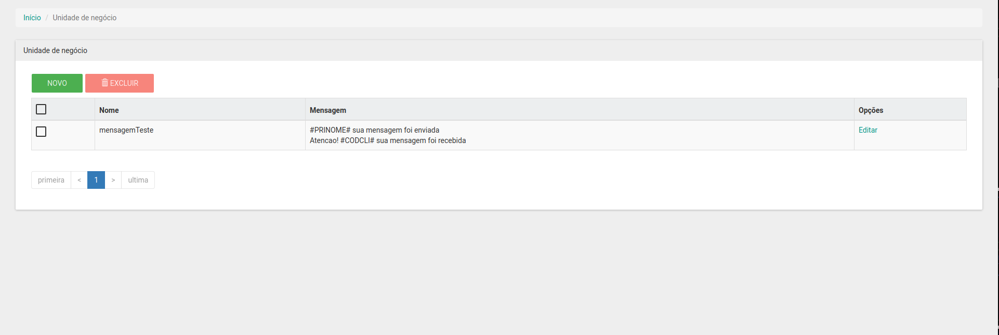
pagina inicial de unidade de negócio.
**Para criar uma nova unidade de negocio clique em novo**
```
Depois de clicar em novo irá aparcer um campo "Nome" nesse você adicionará o nome da unidade de negocio que para selecionar.

Em seguida clique no botão "Adionar mensagem" nesse botão você consegue adiconar as mensagens padrão com as variaveis(por padrao a vairaveis de substuição estara sempre entre # exemplo: #variavel#); pode adicionar quantas mensagens for preciso somente clicando no botão "Adicionar mensagem"
```
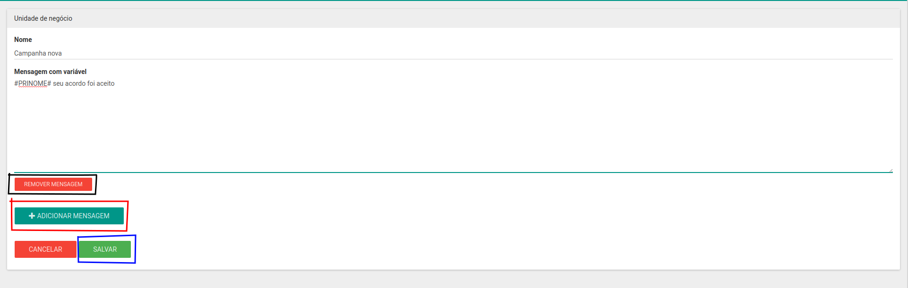
caso queira remover a mensagem basta clicar em "remover mensagem" no botão vermelho abaixo da mensagem que deseja remover. Em seguida clique no botão salvar.

### Atendimento
```
Agora com a unidade de negócio criada vamos para atendimento.
```
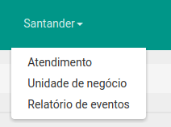

tela inicial do aendimento

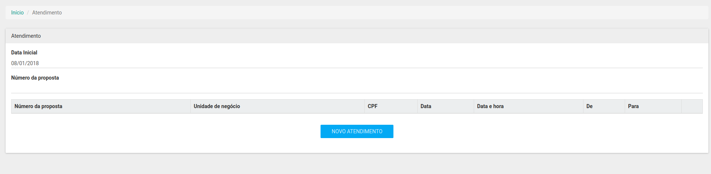
```
tela inicial do atendimento

Os dois primeiros campos são usados parao filtro para ver prosopstas do dia atual ou anteriores. Clique no botão "Novo atendimento" para cria um atentimento vai abrir um modal.
```
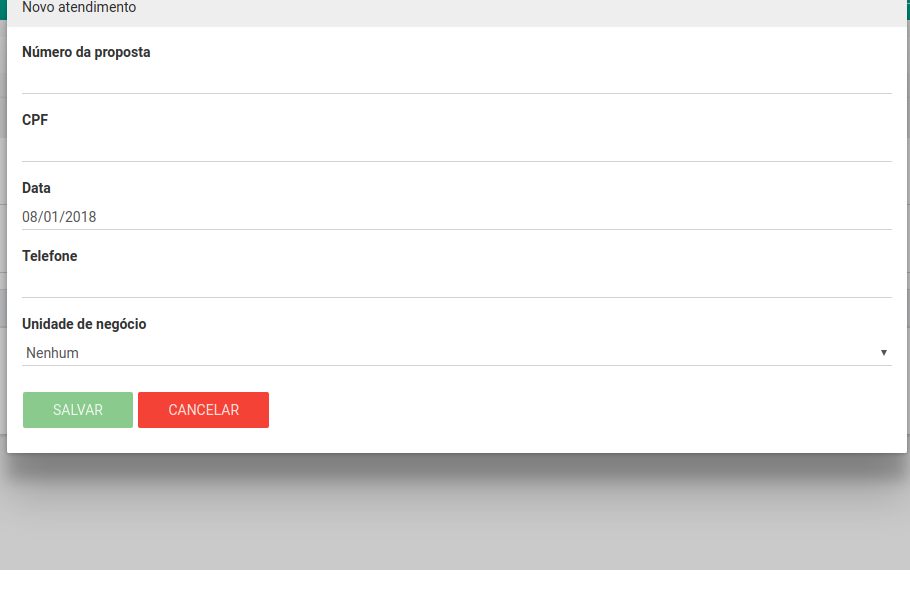
```
Preencha os campos com sua informações, o campo cpf e telefone vem com mascára que automaticamente deixa no formato padrão da informação.
```
depois da unidade de negócio selecionada aparecerá um select para mensagem padrão onde vc escolhe a mensagem que vai querer substiuir as variaveis e enviar

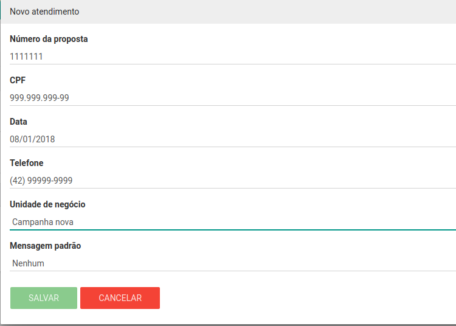
```
depois de selecionado a "Mensagem padrão" vai aparecer um campo com a mensagem selecionado onde vc consegue substituir as varaiveis criadas
```
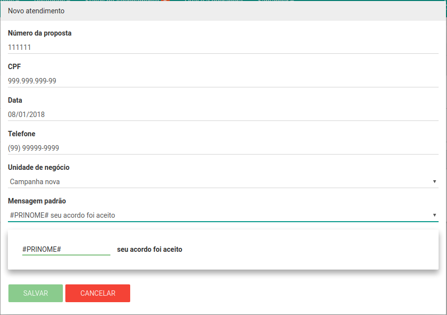

em seguida clique em salvar. Ele somente salvará com todos campos preenchido e com os valores de cpf e telefone validado.

```
Em seguida ele aparecerá na listagem no atendimento clicando no botão evento você vai poder ver todos eventos desse atendimento
```
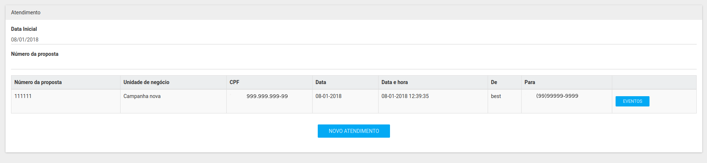

### Eventos

```
Aqui temos todos eventos do atendimentos o momento que foi criado, quando a mensagem foi enviada, quando o cliente respode tambem aparece aqui na listagem.
```
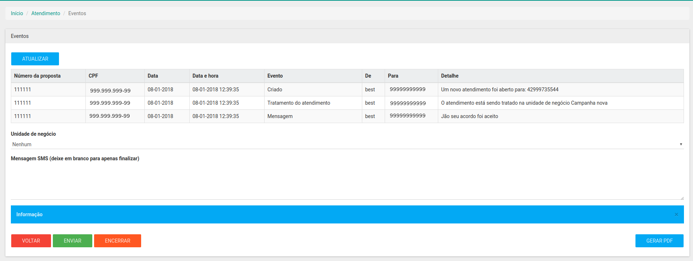

logo embaixo dessa listagem temos a opção de enviar mais mensagem de resposta ou encerrar o atendimento.

```
Caso escolha uma unidade de negócio diferente da primeira o atendimento atualiza com a nova unidade de negocio.
```
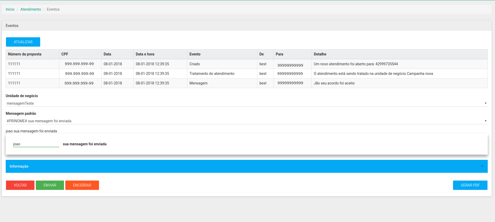
```
Quando clicado em encerrar ficará desta forma
```
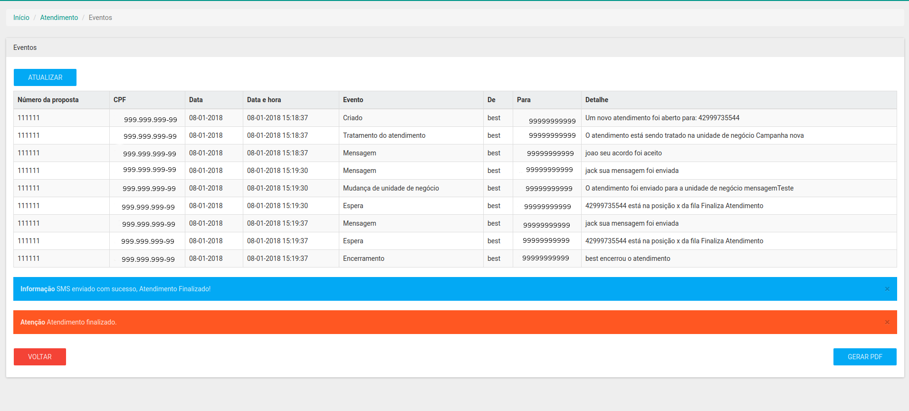
Tambem da para gerar um pdf desse eventos no botão "gerar pdf".

O pdf ficará dessa forma

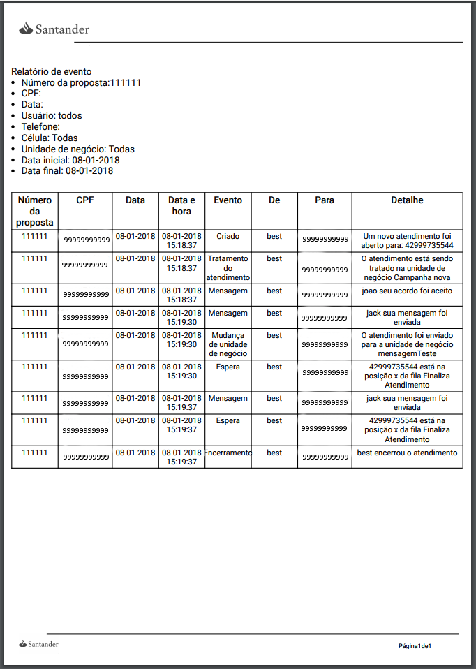

### Relatorio de eventos


```
O relatórios de envento traz todos os eventos de cada atendimento feito atravez do resultado desses filtros que esta na imagem
```

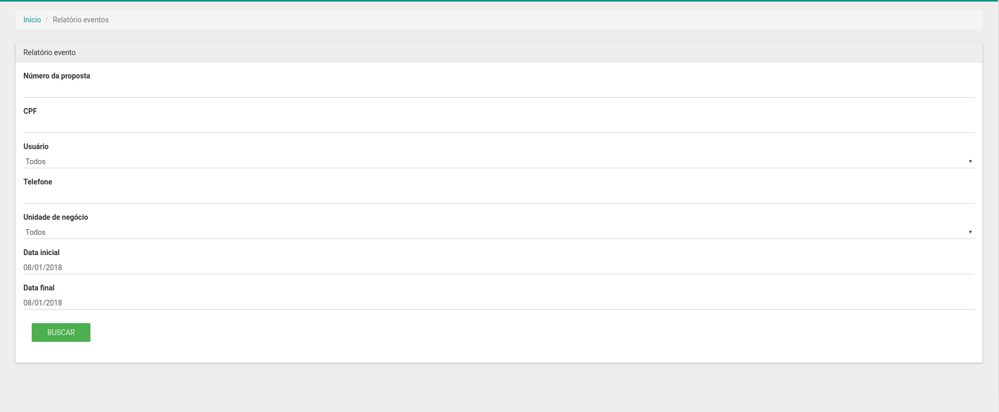

O resultado só vem após o click do botão "buscar"

```
Forma do resultado
```
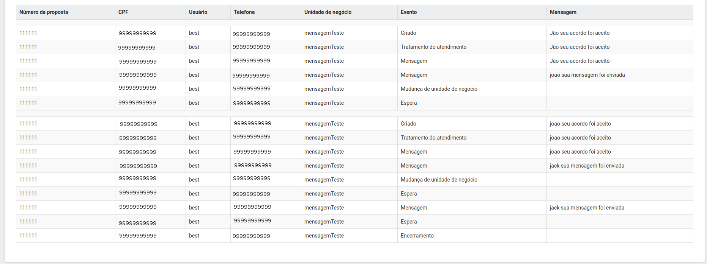
```
Após exibir o resulta você pode clicar no botão "gerar pdf" para ter o pdf dessa listagem
```
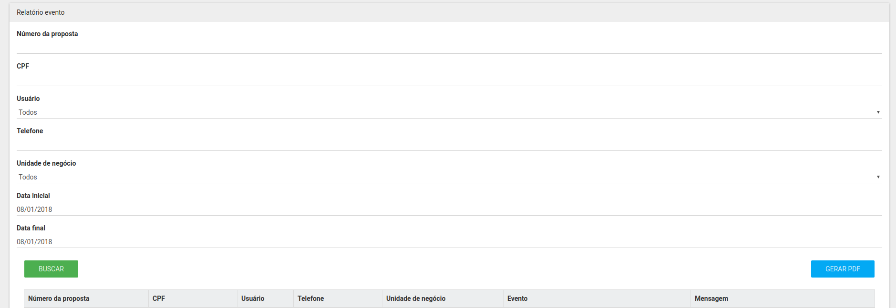
```
PDF do relatorio de eventos
```

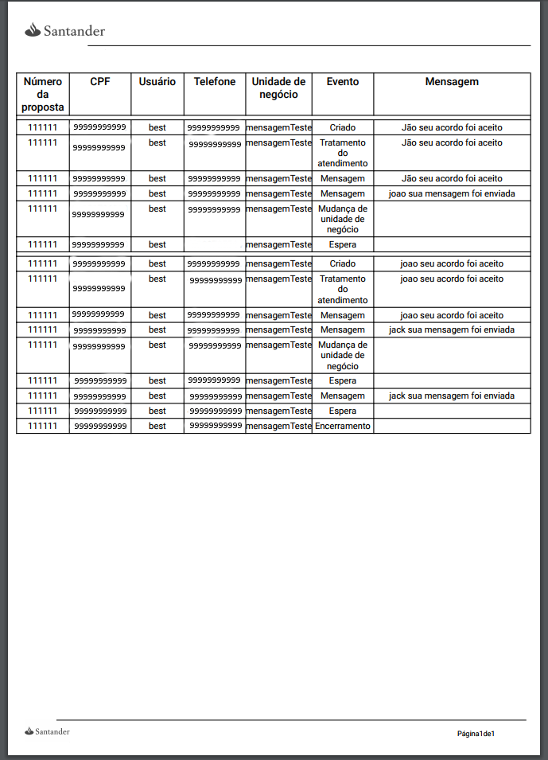