# Manual de uso integração Santander
### Unidade de Negócio
```
Em unidade de negócio é criada as mensagens template a ser usada e para enviar ao cliente
```

pagina inicial de unidade de negócio.

**Para criar uma nova unidade de negocio clique no botão verde "NOVO"**

```
Depois de clicar em "NOVO" irá aparcer uma tela com o campo "Nome", o botão "ADICIONAR MENSAGEM" e o botão "CANCELAR" e  "SALVAR".
```
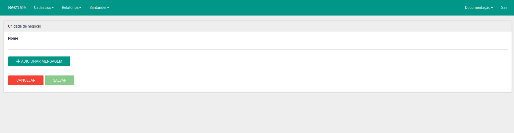

```
no campo "Nome" você adicona o nome que vai aparecer na listagem de mensagens no atendimento
```

Ao clicar no botao "ADICIONAR MENSAGEM" vai aparecer um campo "Mensagem com variavel" nesse campo você escreve a mensagem que deve ser enviado por SMS com essas variaveis sendo substituida pelos valores que estão no pdf quando for feito o upload. O botão "REMOVER MENSAGEM" caso queira apagar esse campo de mensagem. Pode ser adiciona quantos campos de mensagens forem necessario.

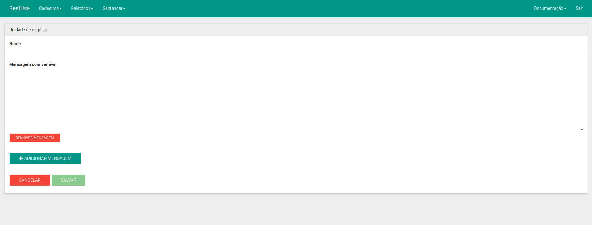

```
No momento existe algumas variaveis default:

#data#,
#cpf#,
#proposta#,
#valorEmprestimo#,
#valorEntregue#,
#iof#,
#valorPremio#,
#jurosMes#,
#jurosAno#,
#valorParcela#,
#quantidadeParcelas#,
#valorTotal#,
#cetMes#,
#cetAno#,
#vencPrimeira#,
#valorAnterior#,
#valorLiberado#,
#valorAntecipar#,
```
Exemplo:

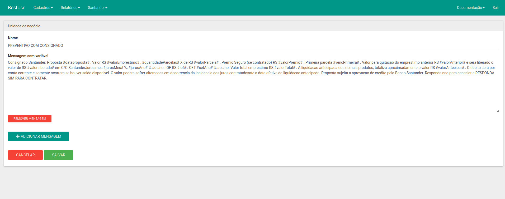

Em seguida clique em  "SALVAR".

**Na home de unidade de negocio você pode clicar em editar para modificar o nome e as mensagens**

### Mensagem Padrão

```
Mensagem padrão é o cadastro de mensagens que serão enviado para o cliente no chat de conversas.
```
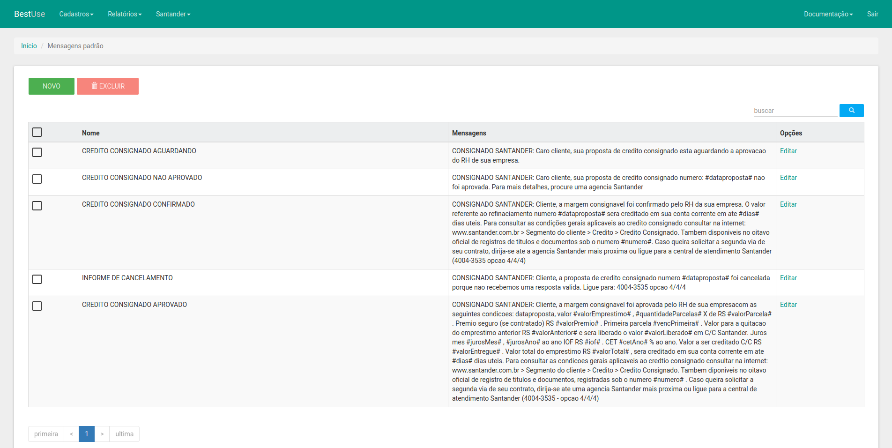
**Para criar uma nova mensagem padrao clique no botão verde "NOVO"**

```
Depois de clicar em "NOVO" irá aparcer uma tela com o campo "Nome" e o campo mensagem, botão "CANCELAR" e  "SALVAR".
```
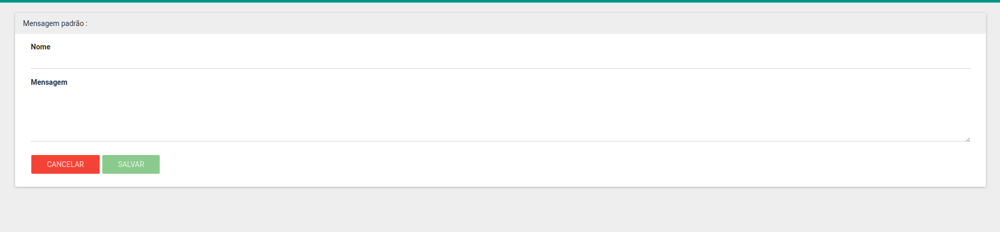

```
no campo "Nome" você adicona o nome que vai aparecer na listagem de mensagens no chat de conversas e o campo "Mensagem" é a mensagem enviada para o cliente
```

Pode ser usado as mesmas variáveis para criar mensagem aqui.

Exemplo:

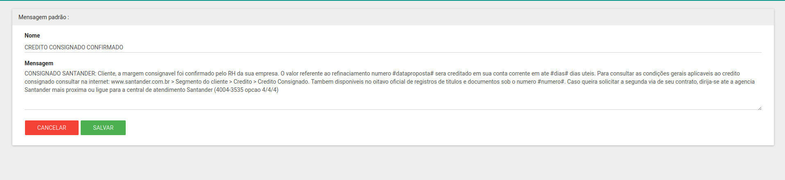

**Na home de mensagens pardrao você pode clicar em editar para modificar o nome e a mensagem**

### Atendimento
```
Agora com a unidade de negócio e mensagens padarão criadas vamos para atendimento onde enviar a mensagem para o cliente.
```
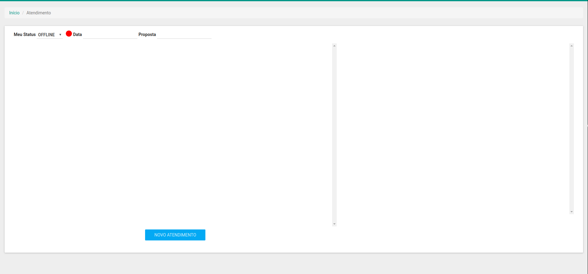

**Antes de criar qualquer atendimento você deve trocar o seu status**

#### **Mudança do Status**
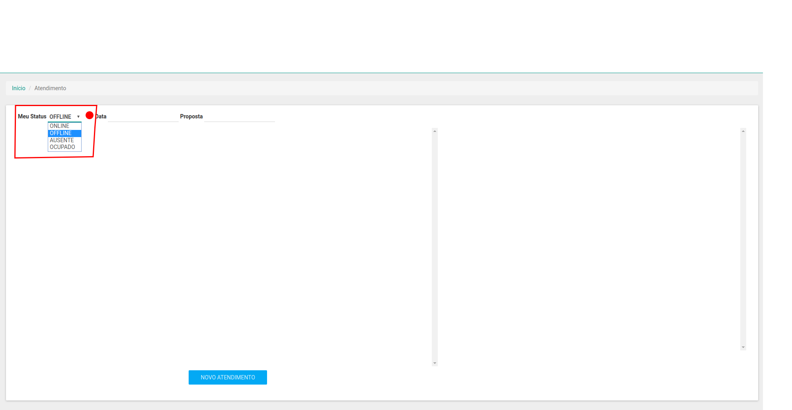
tela inicial do atendimento.

Em seguida clique em "NOVO ATENDIMENTO" para criar seu atendimento


```
No campo "Arquivo" você faz upload de um ou dos dois arquivos default PDF para o envio da mensagem. Assim o upload do arquivo termina os campos "Número da proposta" e "CPF" serão preenchido automaticamente
```
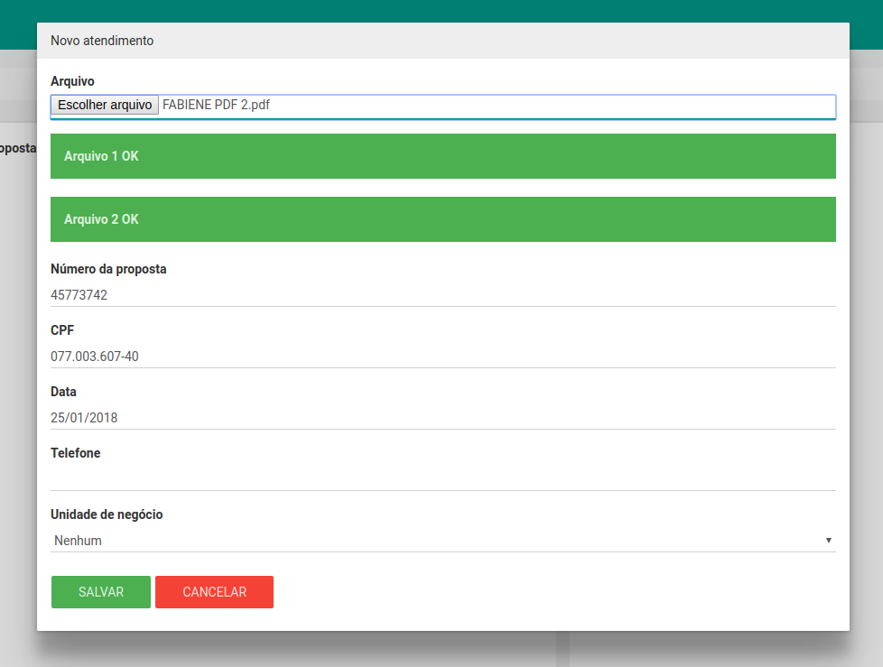

```
Em seguida você deve preencher o campo "Telefone" e escolher uma "Unidade de negocio". Após a seleção de unidade de negocio vai aparecer um campo novo "Mensagem padrao" onde você seleciona as mensagens cadastradas em sua unidade de negócio
```
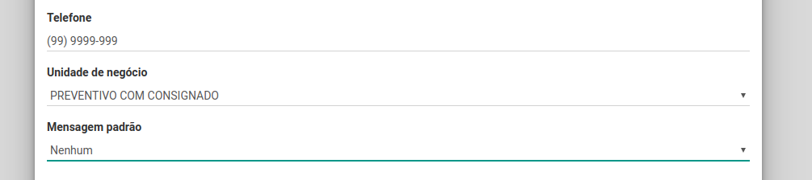

Com a mensagem padrao selecionado o sistema substitui as variavel padrão criado no texto da mensagem e substitui pelos valores contido no pdf.
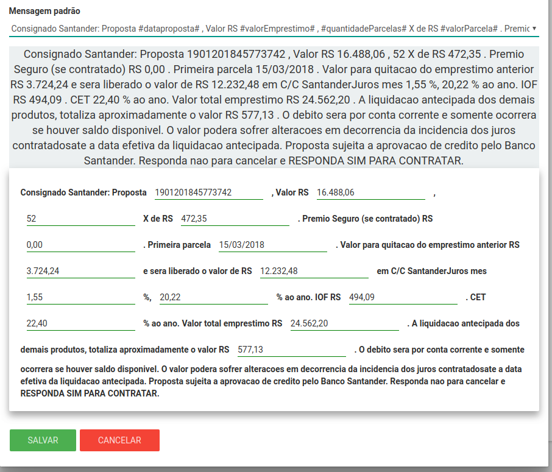

Depois basta clicar em enviar.

```
Após o clique no botão "SALVAR" sua modal de cadastro do atendimneto vai fechar enviando o SMS para o numero de telefone digitado e criando um listagem dos atendimentos não finalizados na tela do atendimento.
```
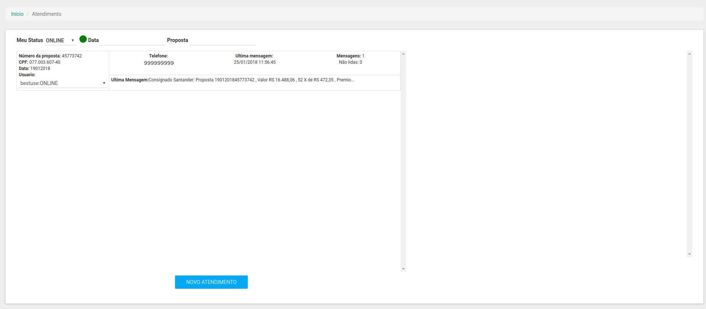

```
Em seguida clique sobre algum atendimento que deseja acompanhar e o chat abri-rá e assim podera acompanhar o retorno do cliente.
```
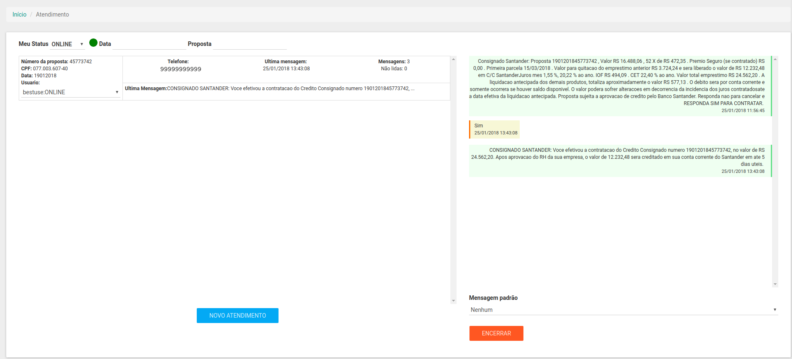

Caso queira respoder tem o select abaixo do chat onde você pode escolher uma das mensagem padrão que foi cadastrado e enviar clicando no botão "ENVIAR".

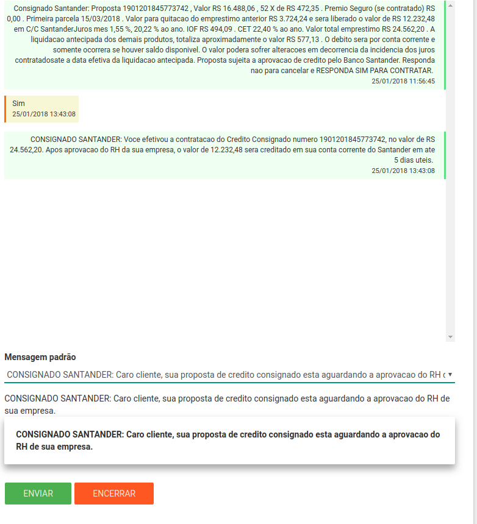
```
Para finalizar o atendimento basta clicar no botão "ENCERRAR"
```

quando o cliente responder alguma mensagem e o chat não estiver aberto ele atualiza na listagem para poder ir acompanhando.

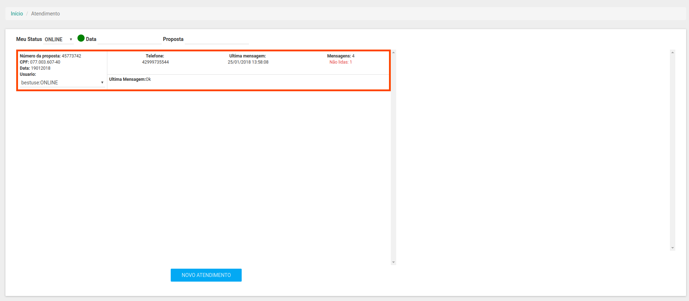

### Relatório de atendimento

```
Em relatório de atendimento é onde se faz busca pelos atendimento usando filtros apresentado na tela e traz os atendimentos filtrado em lista.
```

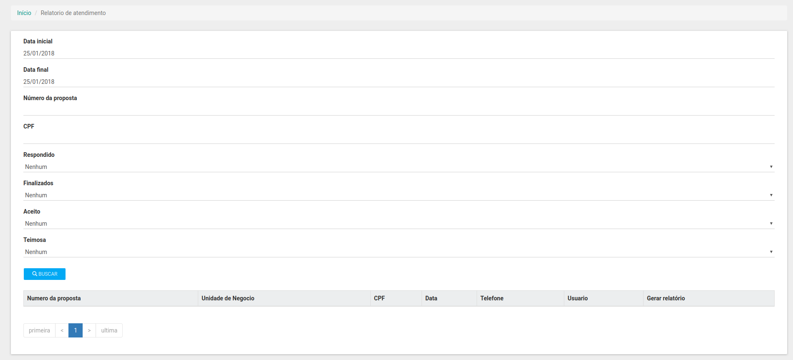

Os filtros diponíveis são: "Data inicial", "Data final", "Número da proposta", "CPF", "Respondido" (se a mensagem envia teve retorno ou não), "Finalizado", "Aceito" (se a mensagem teve como respota a palavra sim), "teimosa" (se foi enviado alguma teimosa).

assim com o filtro preenchido basta clicar em "Buscar".

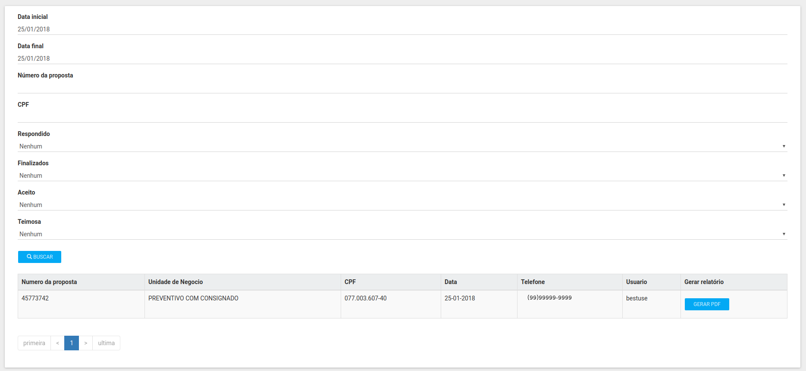

Ao clica no  botão "Gerar pdf" o sistema vai gera um PDF do atendimento com cada evento especifico desse atendimento.

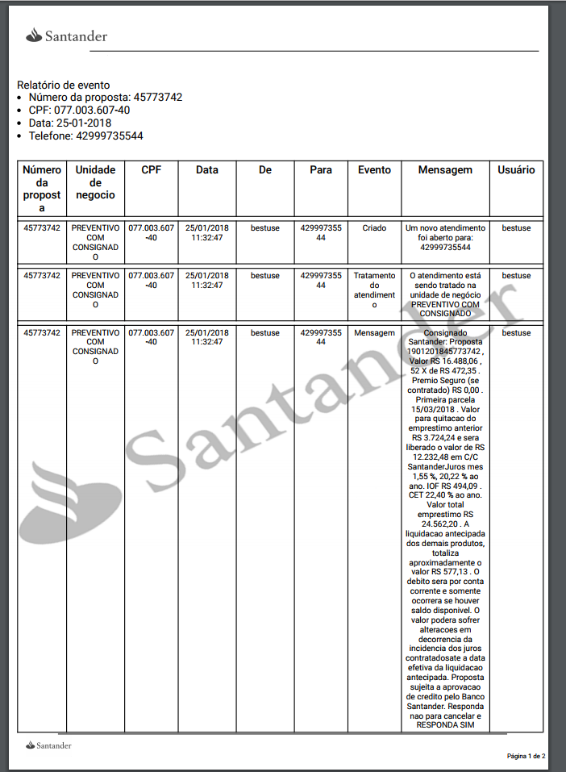